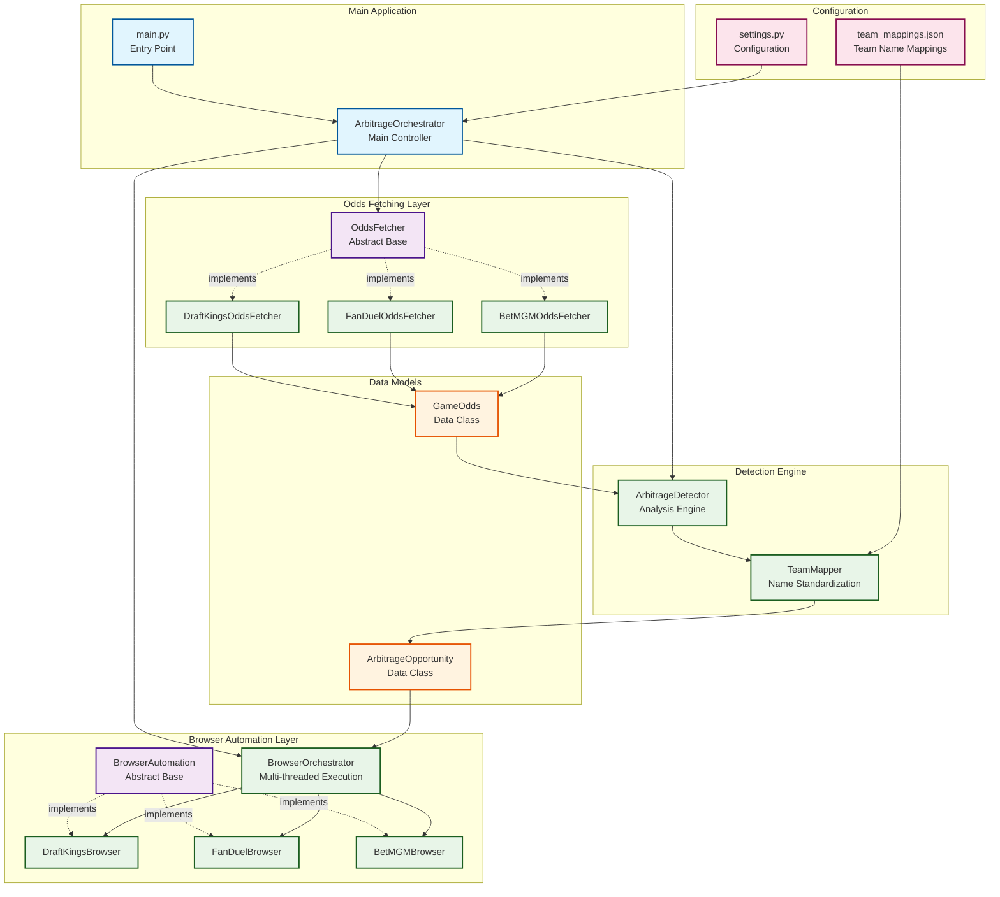
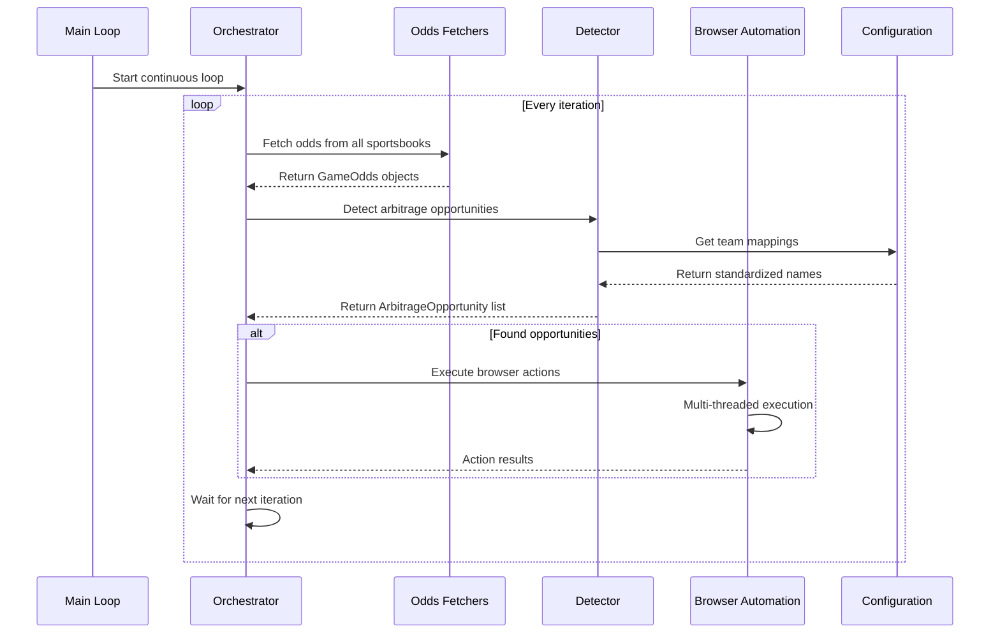
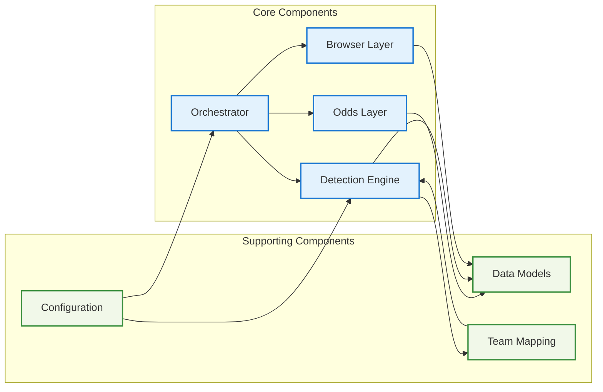
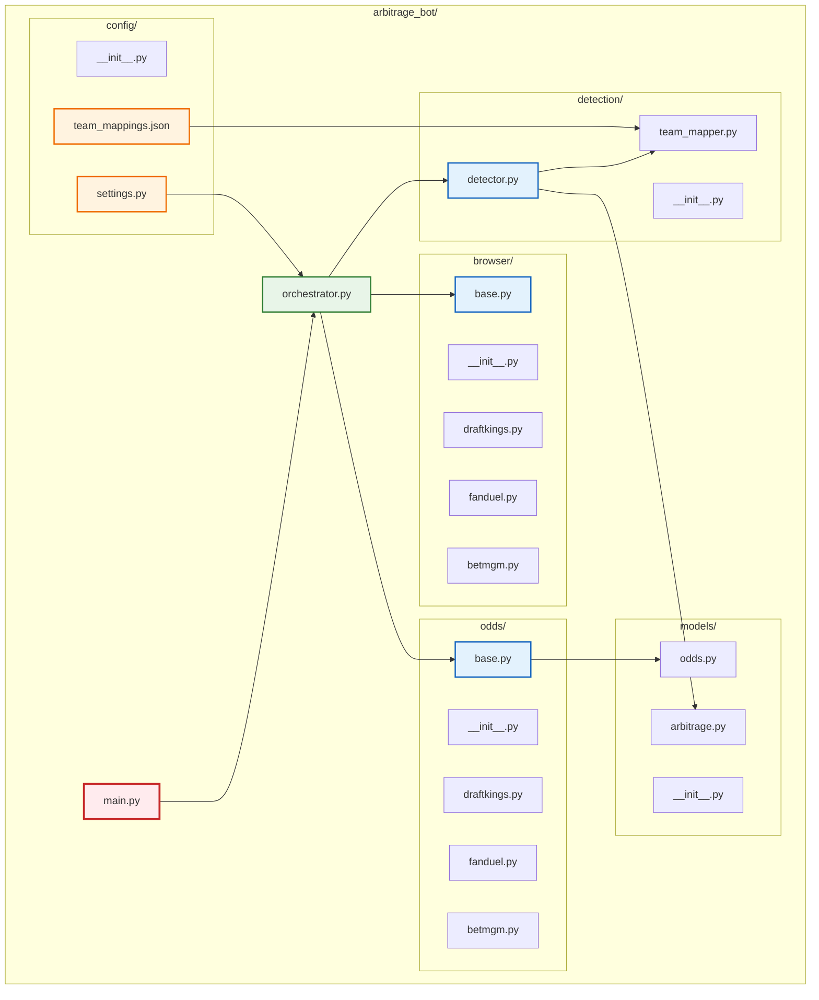

# Arbitrage Bot Architecture Diagram

## System Overview

## Execution Flow Diagram

## Component Relationships

## File Structure Visualization

## Key Design Patterns

1. **Abstract Factory Pattern**: OddsFetcher and BrowserAutomation abstract classes
2. **Strategy Pattern**: Different implementations for each sportsbook
3. **Observer Pattern**: Continuous monitoring loop
4. **Command Pattern**: Browser actions as executable commands
5. **Data Transfer Objects**: GameOdds and ArbitrageOpportunity classes

## Threading Model

-   **Main Thread**: Orchestrator and arbitrage detection
-   **Worker Threads**: Parallel odds fetching from multiple sportsbooks
-   **Browser Threads**: Simultaneous browser automation for both sportsbooks in an opportunity

